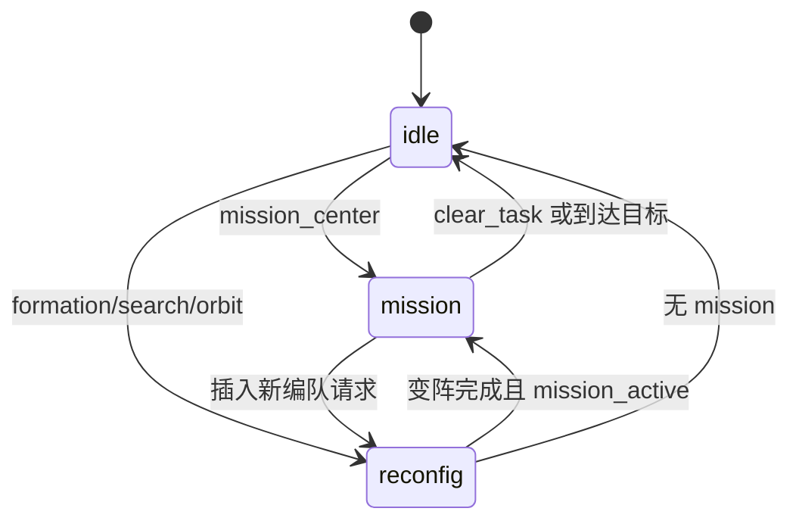

# 基于 ArduPilot + ROS 2 + Gazebo 六机蜂群系统的论文修订技术说明

## 1. 文档目的与适用范围

本文档用于支撑论文二次修改，重点回应以下问题：

1. 第三章“飞行中无停滞编队变换”表述不清，需要明确不停留变换的技术路径。
2. 第四章“任务中断与动态重规划”需要说明如何基于当前位置实时调整路径，并将公式中的可调参数与程序变量一一对应。
3. 第六章“编队切换的数据处理与分层控制”证据不足，需要补充队形变化过程的图示/视频证据，不仅限于高度变化。
4. 全文“算法数学表达式与工程代码的对应关系”不够清晰，需要建立可追踪映射。

本说明依据当前工程代码与已有文档整理，不新增虚构实验结论。

---

## 2. 系统事实基线（供论文统一口径）

### 2.1 仿真与控制链路

1. Gazebo 六机场景在世界文件中固定为 2x3 初始布局，机体模型为 iris_gimbal_i0 至 i5。
2. 每架机模型在 ArduPilotPlugin 中使用不同 fdm_port_in，避免多实例串口/端口干扰。
3. ROS 2 集中式控制核心为 formation_commander，负责编队重构、任务切换、多目标搜索、盘旋搜索。
4. QGC 到蜂群任务的桥接由 qgc_bridge 完成，支持 waypoint/loiter/RTL 到蜂群话题的语义映射。

### 2.2 关键代码定位（建议论文中以“工程实现依据”引用）

1. 队形重构核心：ros2_ws/src/swarm_control/swarm_control/formation_commander.py
2. 控制器参数入口：ros2_ws/src/swarm_control/launch/formation_cmd.launch.py
3. QGC 任务映射：ros2_ws/src/uav_bridge/uav_bridge/qgc_bridge.py
4. 六机场景：gz_ws/src/ardupilot_gazebo/worlds/gazebo_6uav.sdf
5. 模型端口隔离样例：
   - gz_ws/src/ardupilot_gazebo/models/iris_gimbal_i0/model.sdf
   - gz_ws/src/ardupilot_gazebo/models/iris_gimbal_i5/model.sdf

---

## 3. 第三章重点修订：飞行中“无停滞”编队变换的技术路径

### 3.1 现有问题（论文表述层）

当前草稿已提出“LIFT/XY/MERGE 三阶段”，但对“不停留”如何成立的机制交代不足，易被理解为“先悬停再变阵”。

### 3.2 建议在论文中明确的技术定义

建议将“无停滞”定义为：

- 变阵过程不引入额外全队悬停等待阶段。
- 若 mission_center 正在移动，队形重构目标跟随移动中心实时更新，而非固定于静态点。

形式化表达可写为：

设编队中心为 $C(t)$，无人机 $i$ 的目标相对偏移为 $\delta_i(t)$，则全局目标为

$$
P_i^*(t) = C(t) + \delta_i(t)
$$

当处于重构阶段时，$\delta_i(t)$ 由重构目标决定，$C(t)$ 仍由任务中心推进逻辑更新，因此重构与任务位移并行。

### 3.3 工程实现证据链（可直接放入第三章）

1. 目标分配不是单纯最短路：采用“距离代价 + 路径冲突惩罚”。
2. 冲突检测由线段相交与最小距离阈值联合判定。
3. 基于冲突图进行贪心着色，颜色映射为分层高度。
4. 状态机按 LIFT -> XY -> MERGE 执行，且 mission 激活时会持续刷新编队中心。

对应代码逻辑（摘录思路）：

```python
# 1) 目标分配: 距离 + 冲突惩罚
cost += dx * dx + dy * dy
conflicts = self._count_path_conflicts(cur_xy, assigned_targets)
cost += conflicts * self.path_conflict_penalty

# 2) 冲突图着色
if self._path_conflict(start_a, target_a, start_b, target_b):
    graph[did_a].add(did_b)
    graph[did_b].add(did_a)

# 3) 颜色映射高度层
if color == 0:
    desired = self.target_alt
else:
    desired = self.target_alt + self.layer_base_offset + (color - 1) * self.layer_spacing

# 4) mission 活跃时持续更新中心
if self.mission_active:
    self._update_mission_center()
    if self.phase != 'idle' and self.target_offset_xy:
        self._refresh_active_global_xy()
```

### 3.4 建议新增图示（论文第三章）

#### 图 3-x 无停滞变阵流程图（建议）

```mermaid
flowchart TD
    A[收到变阵请求] --> B[计算当前中心 C(t)]
    B --> C[槽位分配: 距离+冲突惩罚]
    C --> D[构建冲突图 G]
    D --> E[图着色得到层号]
    E --> F[LIFT: 仅调 Z 分层]
    F --> G[XY: 分层高度下平移到目标槽位]
    G --> H[MERGE: 统一高度]
    H --> I[进入 IDLE 或执行排队请求]
    B --> J[若 mission_active: C(t) 持续更新]
    J --> G
```

#### 图 3-y 冲突图到高度层映射示意（建议）

- 左图：二维轨迹交叉冲突边。
- 右图：着色后不同层高度轨迹，展示“几何交叉但空域分离”。

### 3.5 建议新增一句“反质疑”说明

建议在第三章末增加：

“本文所谓无停滞，并非单机速度恒定不变，而是指系统不引入额外悬停等待阶段；重构期间允许受控的速度/步长调整，但任务中心推进链路保持连续。”

---

## 4. 第四章重点修订：任务中断与动态重规划

### 4.1 需要补强的核心叙述

当前草稿提出“从当前状态重规划”，但应更明确：

1. 中断时会清理互斥任务状态（mission/search/orbit 与阶段状态）。
2. 新任务以当前观测状态为初值，而非回原点。
3. 任务中心位移采用步长限制推进，避免突变。

### 4.2 建议使用的数学描述

定义系统状态：

$$
s_t = (X_t, \Phi_t, M_t)
$$

其中：

- $X_t$：当前机群状态（位置/高度等）
- $\Phi_t$：主阶段（idle/lift/xy/merge/land）
- $M_t$：任务子状态（mission/search/orbit）

任务中断触发状态转换：

$$
s_{t^+} = \Gamma(s_{t^-}, u_{new})
$$

并满足：

1. $M_t$ 先清理互斥项，再写入新任务。
2. 规划初值来自当前状态快照 $X_t$。

任务中心实时更新可表达为：

$$
C_{t+1} = C_t + \alpha_t (G - C_t), \quad \alpha_t = \frac{\min(\Delta_{max}, \|G-C_t\|)}{\|G-C_t\|}
$$

其中 $\Delta_{max}$ 对应代码中的 mission_step_xy（并随模式缩放）。

### 4.3 公式参数与代码参数映射表（可直接放第四章）

| 论文参数/符号 | 含义 | 工程参数名 | 作用位置 |
| --- | --- | --- | --- |
| $d_{safe}$ | 路径最小安全间距阈值 | path_conflict_distance | 冲突判定 |
| $\lambda_{conf}$ | 冲突惩罚权重 | path_conflict_penalty | 目标分配总代价 |
| $\Delta h$ | 分层间距 | layer_spacing | 图着色高度映射 |
| $h_{bias}$ | 分层基偏置 | layer_base_offset | color>0 时增高 |
| $\epsilon_{xy}^{rec}$ | 重构 XY 误差阈值 | xy_tolerance_reconfig | 重构到位判定 |
| $\epsilon_z^{rec}$ | 重构 Z 误差阈值 | z_tolerance_reconfig | 重构到位判定 |
| $\Delta_{max}$ | mission 中心最大步长 | mission_step_xy | 中心更新 |
| $k_{rec}$ | 变阵慢速系数 | mission_step_xy_reconfig_scale | 变阵阶段降速 |
| $k_{xy}$ | XY 阶段附加缩放 | mission_step_xy_xy_scale | XY 阶段限速 |
| $k_{queue}$ | 排队请求附加缩放 | mission_step_xy_queue_scale | merge/land 阶段限速 |

### 4.4 建议加入的代码型证据

```python
# clear_task: 任务中断后的状态清理
self.phase = 'idle'
self.mission_active = False
self._clear_search_state()
self._clear_orbit_state()
self._clear_motion_targets()

# mission 中心实时推进
dx = self.mission_center_goal[0] - self.mission_center_current[0]
dy = self.mission_center_goal[1] - self.mission_center_current[1]
step_limit = self._mission_step_limit()
step = min(step_limit, dist)
self.mission_center_current[0] += dx * step / max(dist, 1e-6)
self.mission_center_current[1] += dy * step / max(dist, 1e-6)
```

### 4.5 建议新增图示（论文第四章）



---

## 5. 第六章重点修订：编队切换的数据处理与分层控制证据

### 5.1 现有问题

当前第六章较多强调“高度调整”，但摘要承诺的是“编队切换过程与任务连续性”。因此需要把“队形几何变化”也展示出来。

### 5.2 建议补充的数据链路

建议至少输出下列四类时序数据（可由日志或录屏后离线统计得到）：

1. 阶段时间轴：lift/xy/merge 开始与结束时刻。
2. 各机平面槽位误差：$e_{xy,i}(t)$。
3. 各机高度轨迹：$z_i(t)$。
4. 最小机间距：$d_{min}(t)$。

建议定义：

$$
e_{xy,i}(t)=\left\|\begin{bmatrix}x_i(t)\\y_i(t)\end{bmatrix}-\begin{bmatrix}x_i^*(t)\\y_i^*(t)\end{bmatrix}\right\|_2
$$

$$
d_{min}(t)=\min_{i\neq j}\|p_i(t)-p_j(t)\|_2
$$

### 5.3 建议补充的图和视频证据清单

1. 图 6-a：队形切换俯视图序列（至少 5 帧：起始/分层开始/交叉穿越/归并前/完成）。
2. 图 6-b：阶段时间甘特图（6 架机共享阶段，突出无停滞连续推进）。
3. 图 6-c：最小机间距曲线，标注安全阈值线。
4. 图 6-d：mission_center 与编队中心轨迹对比图，证明变阵期间任务中心仍推进。
5. 视频证据 V1：line_x -> v_shape 飞行中切换全过程（含状态面板）。
6. 视频证据 V2：任务中断后直接重规划，不回原点示例。
7. 视频证据 V3：多目标加权搜索分配后各子群展开过程。

### 5.4 第六章建议新增“分层控制不是仅调高度”段落

建议增加如下表述：

“分层控制在工程实现上包含三部分：
（1）冲突图驱动的临时高度分离；
（2）分层状态下的平面槽位收敛；
（3）归并后的稳态任务接续。故其控制对象是三维队形状态与任务相位的联合，而非单纯高度调节。”

---

## 6. 数学表达式与工程代码的一致性映射（总表）

| 论文模块 | 数学对象 | 代码实现要点 |
| --- | --- | --- |
| 槽位分配 | $\min\sum\|x_i-y_{\pi(i)}\|^2 + \lambda_{conf}N_{conf}$ | _assign_targets 中枚举排列并叠加冲突惩罚 |
| 冲突判定 | 线段相交或净空小于阈值 | _segments_intersect + _point_to_segment_distance_sq + _path_conflict |
| 冲突图 | $G=(V,E)$ | _build_conflict_graph |
| 图着色分层 | $h_i=f(c_i)$ | _build_layer_plan（贪心着色 + 高度映射） |
| 三阶段执行 | lift/xy/merge | _control_loop 中 phase 分支 |
| 动态中心推进 | $C_{t+1}=C_t+\alpha(G-C_t)$ | _update_mission_center |
| 中断清理 | 状态映射 $\Gamma$ | _on_clear_task 与请求处理逻辑 |
| QGC 任务语义映射 | 任务类型到蜂群命令 | _dispatch_uploaded_mission |

---

## 7. 可直接替换到论文的修订段落模板

### 7.1 第三章修订模板（节选）

“本系统的飞行中无停滞变阵通过‘冲突感知分配-图着色分层-三阶段执行’实现。首先，在槽位分配阶段将路径冲突数纳入总代价函数，避免仅按最短距离导致的大量交叉航路。其次，基于候选轨迹构建冲突图并执行贪心着色，将二维冲突转化为可执行的垂向分层。最后，由阶段机依次执行 lift、xy、merge；在 mission 激活时，编队中心持续更新并刷新目标槽位，因此变阵过程不需要额外悬停等待，任务推进与队形重构并行完成。”

### 7.2 第四章修订模板（节选）

“任务中断机制采用当前状态重规划而非回原点重启。系统在接收新任务时先清理互斥任务标志与阶段状态，再以当前观测到的编队状态作为新任务初值。任务中心更新遵循步长受限推进策略，既保证轨迹连续性，也限制突变指令造成的控制抖动。该机制提高了高频人工干预场景下的响应稳定性。”

### 7.3 第六章修订模板（节选）

“为验证分层控制的有效性，本文不仅分析高度轨迹，还联合展示俯视队形序列、最小机间距曲线、阶段时间轴与任务中心连续推进轨迹。实验结果表明，分层策略在保证安全间隔的同时实现了队形几何的连续重构，满足摘要中关于‘飞行中编队切换’的承诺。”

---

## 8. 你下一步写论文时可直接执行的动作

1. 第三章加入流程图与冲突图示意，并替换“无停滞”定义。
2. 第四章增加“公式参数-程序参数映射表”。
3. 第六章补充俯视序列图、最小间距曲线、阶段时间图和视频链接。
4. 在附录给出关键参数配置来源（launch 参数 + commander 内默认参数）。

以上四步完成后，论文将从“概念描述”升级为“可验证的工程论证”。
